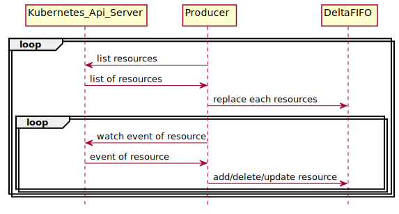
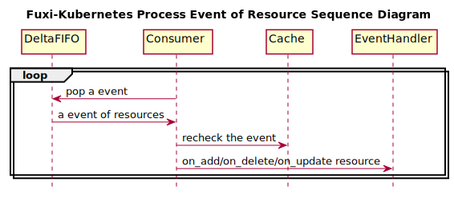

..
 This work is licensed under a Creative Commons Attribution 3.0 Unported
 License.

 http://creativecommons.org/licenses/by/3.0/legalcode

Provisioner -- Watch Framework
==============================

Watch framework implements a mechanism which watches a kind of resource of
Kubernetes and exposes a set of interfaces to proccess each event of
corresponding resource. It is a classic Producer & Consumer model that
Producer watches a resource and stores the events to a storage, and meanwhile
the Consumer gets each event from storage and invokes corresponding  handler
to process it. Producer, Consumer and Storage have the following class diagram.

.. figure:: ../../images/watch_framework_class_diagram.svg
    :alt: Watch Framework -- Class Diagram
    :align: center

1. **Producer:**
 Producer watches a resource and stores the events to a storage. The following
is the sequence diagram

First, Producer lists the resources and replaces them in the storage which will
generate an event of SYNC for each of them. Besides, list operation also gets an
initial resource version which will be used in the first time watch operation.
Second Producer watches resources circularly by passing the resource version to
kubernetes and each time it gets a new resource version which will be used in
the next invoking.

2. **Consumer:**
 Consumer get each event from storage and invoke corresponding handler to process
it. The following sequence diagram describes this process.

3. **DeltaFIFO:**
 DeltaFIFO is the storage which stores and outputs the event of resource in the
way of FIFO. Besides, a resource may has several events in a very short period,
DeltaFIFO uses a map of list named '_items' to store them and a list named '_queue'
to store the key of resource. To be specific, when adding an event of resource. first,
generate an unique key of resource, second, append the event of resource to
'_items[key]', and if the key is not in the '_items', then append the key to the
'_queue'. When outputing an event, pop the the event of '_items[ _queue[0] ][0]'.

4. **_KnownObject:**
 _KnownObject stores the known events of resource and will be used to convert the
events. For example, when popping an event of SYNC, it should be checked with
_KnownObject to generate the real event. If it exists in _KnownObject, then the
event should be UPDATED, otherwise it is the event of ADDED.
