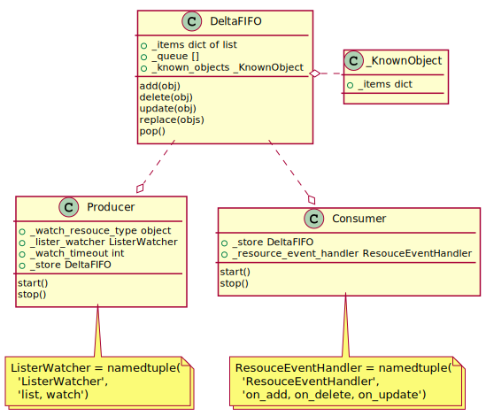
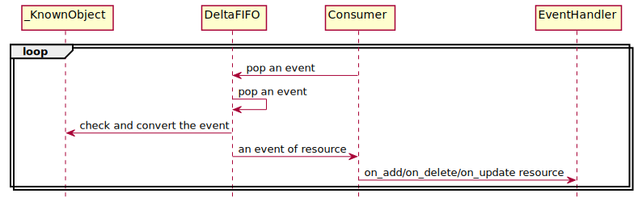

..
 This work is licensed under a Creative Commons Attribution 3.0 Unported
 License.

 http://creativecommons.org/licenses/by/3.0/legalcode

Provisioner -- Watch Framework
==============================

Watch framework implements a mechanism which watches a kind of resource of
Kubernetes and exposes a set of interfaces to proccess each event of
corresponding resource. It is a classic Producer & Consumer model that
Producer watches a resource and stores the events to a storage, and meanwhile
the Consumer gets each event from storage and invokes corresponding  handler
to process it. Producer, Consumer and Storage have the following class diagram.

1. **Producer**
Producer watches a resource and stores the events to a storage. The following
sequence diagram

2. **Consumer**
Consumer get each event from storage and invoke corresponding handler to process
it. The following sequence diagram describes this process.

3. **DeltaFIFO**
DeltaFIFO is the storage which stores and outputs the event of resource in the
way of FIFO. Besides, a resource may has several events in a very short period,
DeltaFIFO uses a map of list named '_items' to store them and a list named '_queue'
to stoe the key of resource. To be spcific, when adding an event of resource. first,
generate an unique key of resource, second, append the event of resource to
'_items[key]', and if the key is not in the '_items', then append the key to the
'_queue'. When outputing an event, pop the the event of '_items[ _queue[0] ][0]'.

4. **Cache**
Cache stores the known events of resource.
